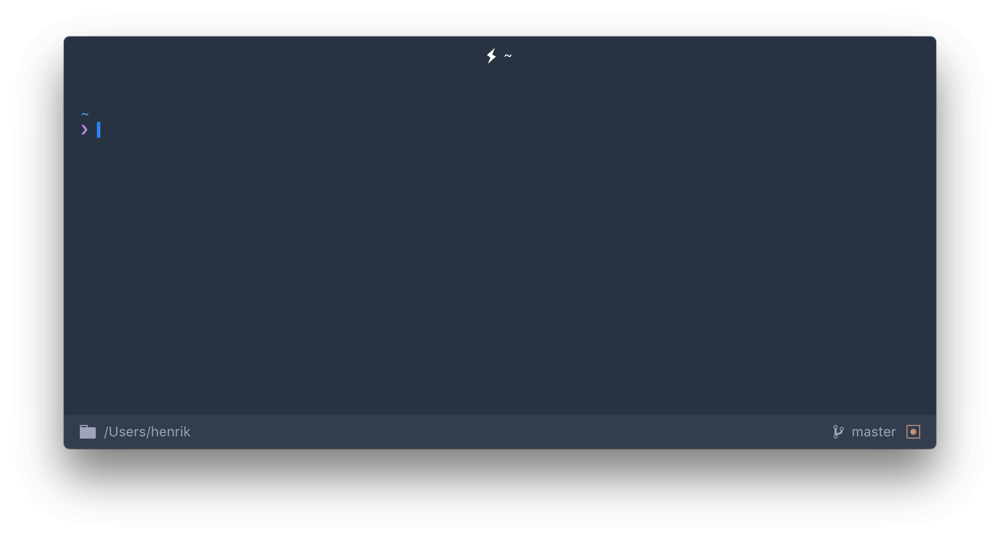

# hyper-statusline [](https://www.npmjs.com/package/hyper-statusline) [](https://www.npmjs.com/package/hyper-statusline)

> Status Line Plugin for [Hyper](https://hyper.is). Shows clickable useful information. Matches any theme.




## Install

Add following to the plugins array in your `~/.hyper.js` config.

```javascript
module.exports = {
  ...
  plugins: ['hyper-statusline']
  ...
}
```


## Config

Add following to `~/.hyper.js`.

### Disable Footer Transparency

```javascript
module.exports = {
  config: {
    ...
      hyperStatusLine: {
        footerTransparent: true,
      }
    ...
  }
}
```

### Change Git Dirty Color

```javascript
module.exports = {
  config: {
    ...
      hyperStatusLine: {
        dirtyColor: 'pink'
      }
    ...
  }
}
```


## Theme

* [hyperterm-chesterish](https://github.com/henrikdahl/hyperterm-chesterish)


## License

MIT © Henrik Dahlheim
